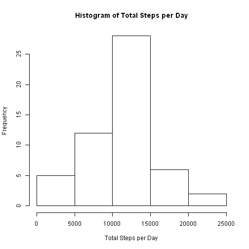
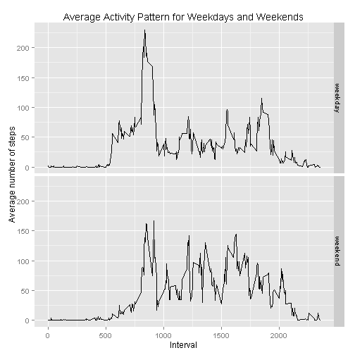

### **Loading and preprocessing the data**

Load required libraries for this research

```r
library(dplyr)
library(lubridate)
library(ggplot2)
```
Load data from csv file

```r
act_data <- read.csv("activity.csv")
```
Convert date factors to Date objects

```r
act_data$date <- ymd(act_data$date)
```


### **What is mean total number of steps taken per day?**

Remove rows with NA values

```r
act_data_no_na <- act_data[complete.cases(act_data),]
```
Group data by Date

```r
act_data_byDate <- group_by(act_data_no_na, date)
```
Calculate total number of steps per day

```r
total_steps_per_day <- summarize(act_data_byDate, total_steps=sum(steps))
```
Plot a histogram for the total number of steps taken per day

```r
hist(
    total_steps_per_day$total_steps,
    xlab = "Total Steps per Day",
    main="Histogram of Total Steps per Day"
  )
```

 

Calculate the mean and median of the total number of steps per day

```r
mean(total_steps_per_day$total_steps)
```

```
## [1] 10766.19
```

```r
median(total_steps_per_day$total_steps)
```

```
## [1] 10765
```


### **What is the average daily activity pattern?**

Compute the mean for each 5-minute interval

```r
act_data_by5MinInterval <- group_by(act_data, interval)
mean_per_5MinInterval <- summarize(act_data_by5MinInterval, mean_steps=round(mean(steps,na.rm = T))) 
```
Make a time series plot of the 5-minute interval (x-axis)  
and the average number of steps taken (y-axis)

```r
plot(
    x = mean_per_5MinInterval$interval,
    y = mean_per_5MinInterval$mean_steps,
    type = "l",
    main = "Average Daily Activity Pattern",
    xlab = "Interval",
    ylab = "Average number of steps"
  )
```

 

Find the 5-minute interval with the maximum number of steps

```r
max_steps = max(mean_per_5MinInterval$mean_steps)
mean_per_5MinInterval[mean_per_5MinInterval$mean_steps == max_steps, "interval"]
```

```
## Source: local data frame [1 x 1]
## 
##   interval
## 1      835
```


### **Imputing missing values**

Count the total number of rows with missing values in the dataset

```r
sum(!complete.cases(act_data))
```

```
## [1] 2304
```
Missing values is filled by using the mean of the respective 5-minute interval  
First, the mean for each 5-minute interval is computed

```r
act_data_by5MinInterval <- group_by(act_data, interval)
mean_per_5MinInterval <- summarize(act_data_by5MinInterval, mean_steps=round(mean(steps,na.rm = T)))
```
Then, a new dataset is created by filling the NA values in the original dataset

```r
new_act_data = act_data
for (row_index in which(!complete.cases(act_data))) {
  interval_mean_index <- mean_per_5MinInterval$interval == new_act_data[row_index,"interval"]
  new_act_data[row_index,"steps"] <- mean_per_5MinInterval[interval_mean_index,"mean_steps"]
}
```
Plot a histogram for the total number of steps taken per day  
using the new dataset

```r
act_data_byDate <- group_by(new_act_data, date)
total_steps_per_day <- summarize(act_data_byDate, total_steps=sum(steps))
hist(
    total_steps_per_day$total_steps,
    xlab = "Total Steps per Day",
    main="Histogram of Total Steps per Day"
  )
```

 

Calculate the mean and median of the total number of steps per day  
using the new dataset

```r
mean(total_steps_per_day$total_steps)
```

```
## [1] 10765.64
```

```r
median(total_steps_per_day$total_steps)
```

```
## [1] 10762
```


### **Are there differences in activity patterns between weekdays and weekends?**

Create a new factor column to indicate "weekday" or "weekend"  
Monday to Friday are treated as "weekday"  
Saturday and Sunday are treated as "weekend"  

```r
dayType = factor(c("weekday","weekend"))
getDayType = function(date) {
  daynum = as.POSIXlt(date)$wday
  if (daynum == 0 || daynum == 6) {
    dayType[2]
  } else {
    dayType[1]
  }
}

data_with_dayType = mutate(new_act_data, dayType = sapply(date, getDayType))
```
Group data by dayType and compute the mean  
for each 5-minute interval for each dayType

```r
data_grpByDayType <- group_by(data_with_dayType, interval, dayType)
mean_per_5MinInterval_per_dayType <- summarize(data_grpByDayType, mean_steps=round(mean(steps,na.rm = T)))
```
Make a panel plot containing a time series plot of the 5-minute interval (x-axis)  
and the average number of steps taken,  
averaged across all weekday days or weekend days (y-axis).

```r
qplot(
    x = interval,
    y = mean_steps,
    data = mean_per_5MinInterval_per_dayType,
    geom = "line",
    facets = dayType ~.,
    main = "Average Activity Pattern for Weekdays and Weekends",
    xlab = "Interval",
    ylab = "Average number of steps"
  )
```

 
